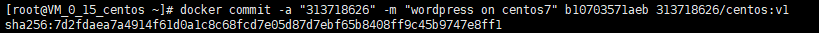
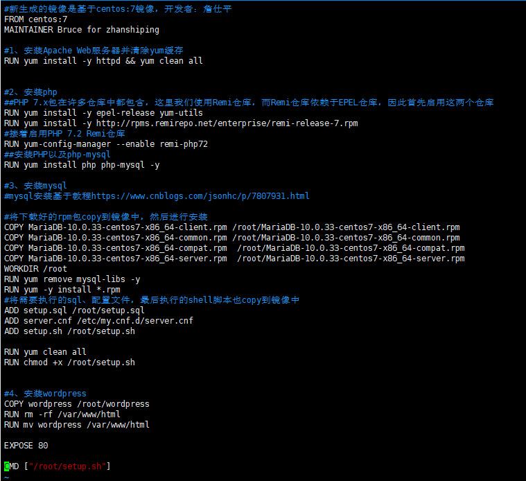

# 一、安装Docker

## 1、先决条件

- 已安装CentOS 7，并且内核版本大等于3.10，本文使用的是阿里云的镜像：[CentOS镜像](http://mirrors.aliyun.com/centos/7/isos/x86_64/)。
- 非root用户已获得sudo特权。

### 1.1、使用如下命令查看操作系统内核信息：uname -r

### 1.2、顺带看一下Linux的版本号：cat/etc/redhat-release

可见阿里云镜像保存的是CentOS 7.6

### 1.3、如果当前用户不能使用sudo权限，登录到root用户，在终端键入：

### gpasswd -a user wheel

这里user指代希望授权的用户。该命令将user用户加入“wheel”用户组。在CentOS 7中默认情况下，wheel用户组的用户能够使用sudo命令。

## 2、安装Docker

### （我是在root用户下进行安装，非root用户在命令前添加sudo）

### 2.1、CentOS 7的应用程序库可能不是最新的，因此首先更新应用程序数据库：yum check-update

### 2.2、接下来添加Docker的官方仓库，下载最新的Docker并安装：

### curl -fsSL https://get.docker.com/ | sh

“一键”脚本自动安装，但是docker镜像在境外，这个过程非常缓慢，甚至无法完成。那么请参考其他安装方式[CentOS Docker 安装](https://www.runoob.com/docker/centos-docker-install.html)。

### 2.3、安装完成之后启动Docker守护进程，即Docker服务：

### systemctl start docker

### 2.4、验证Docker是否成功启动：systemctl status docker

### 2.5、最后，确保Docker当服务器启动时自启动：

### systemctl enable docker

### 2.6、此外，还可以查看一下Docker的版本信息：docker version

# 二、拉取CentOS镜像，并基于该镜像运行容器，在容器实例上完成WordPress的安装，并推送到Docker Hub

## 1、Docker基本操作

### 1.1、Docker的命令使用
注意：Docker的操作需要用户获得root权限。

### 1.2、Docker命令的基本格式：docker [选项] [命令] [参数]

### 1.3、查看docker所有的命令，键入：docker

得到类似如下图所示的命令说明（图片不完全覆盖所有命令）：

### 1.4、特定命令的使用帮助：docker 特定命令 –help

### 1.5、查看当前系统docker的相关信息：docker info

可见当前并未安装任何镜像（Images），运行任何容器（Containers）。

## 2、加载Docker的CentOS镜像

### 2.1、Docker镜像是容器运行的基础，默认情况下，将从Docker Hub拉取镜像。首先使用search命令查询Docker Hub中的可用镜像，这里以查询可用的CentOS镜像为例：

### **docker search centos**

命令从Docker Hub拉取centos镜像的相关信息，并返回可用镜像的列表，输出结果：

### 

### 2.2、接下来拉取官方版本(OFFICIAL)的镜像：docker pull centos:7

### 2.3、查看一下当前系统中存在的镜像：docker images

### 2.4、运行Docker容器

（为了方便检测后续wordpress搭建是否成功，需设置端口映射（-p），将容器端口80 映射到主机端口8888，Apache和MySQL需要 systemctl 管理服务启动，需要加上参数 –privileged 来增加权限，并且不能使用默认的bash，换成 init，否则会提示 Failed to get D-Bus connection: Operation not permitted ，-name 容器名  ，命令如下 ）

###### docker run -d -it --privileged --name wordpress -p 8888:80 -d centos:7 /usr/sbin/init

### 2.5、查看已启动的容器：docker ps 

### 2.6、进入容器前台（容器id可以只写前几位，如 ：b10）

### docker exec -it b10 /bin/bash

其中b1070357laeb是容器的ID，后续要用到。你可以在此shell运行任何命令。

## 3、在Docker的CentOS容器实例中安装WordPress

#### 参照https://github.com/zhanshiping/CloudComputing/tree/master/WordPress

#### （该教程里访问公网IP都需加上端口  :8888)

#### 安装完成后可通过浏览器访问  服务器IP:8888（http://106.54.102.167:8888/） 查看

#### 由于安装快结束才了解需要截图来验证，所以只截图了安装配置WordPress的一小部分来验证

### 3.1、下载WordPress至当前用户的主目录

### cd ~

### 

### wget http://wordpress.org/latest.tar.gz

### 3.2、wget命令从WordPress官方网站下载最新的WordPress集成压缩包，解压该文件：tar xzvf latest.tar.gz

### 3.3、解压之后在主目录下产生一个wordpress文件夹。我们将该文件夹下的内容同步到Apache服务器的根目录下，使得wordpress的内容能够被访问。这里使用rsync命令：

### rsync -avP ~/wordpress/ /var/www/html/

### 3.4、接着在Apache服务器目录下为wordpress创建一个文件夹来保存上传的文件：mkdir /var/www/html/wp-content/uploads

### 3.5、对Apache服务器的目录以及wordpress相关文件夹设置访问权限：

### chown -R apache:apache /var/www/html/*

### 3.6、大多数的WordPress配置可以通过其Web页面完成，但首先通过命令行连接WordPress和MySQL。

### 定位到wordpress所在文件夹：cd /var/www/html

### 3.7、WordPress的配置依赖于wp-config.php文件，当前该文件夹下并没有该文件，我们通过拷贝wp-config-sample.php文件来生成：

### cp wp-config-sample.php wp-config.php

### 3.8、然后，通过nano超简单文本编辑器来修改配置，主要是MySQL相关配置：nano wp-config.php

### 3.9、通过浏览器访问  服务器IP:8888（http://106.54.102.167:8888/） 查看验证成功在CentOS容器实例中安装WordPress

## 4、将带有WordPress的CentOS镜像推送到容器仓库

### 4.1、首先前往[*docker hub*](https://hub.docker.com/)*注册账号*，方便后续使用

### （用户名：313718626）

### 登录

### 4.2、将容器生成镜像 

###  (所生成的镜像名由   “Docker用户名/Docker仓库名“组成  ，否则推送会报错： denied: requested access to the resource is denied )

docker commit -a "Docker用户名" -m "提交描述" 容器id 镜像名:tag标签

举例 docker commit -a "313718626" -m "wordpress on centos7" b10703571aeb 313718626/centos:v1

### 4.3、登录Docker：docker login

### 4.4、推送镜像

### docker push 镜像名:tag（标签）

### \# 举例  docker push 313718626/centos:v1

### 4.5、登录Docker网页查看仓库

# 三、利用Dockerfile创建一个完成WordPress安装的镜像并推送到Docker Hub

本文参考教程https://yq.aliyun.com/articles/617789

本文参考教程（mysql部分）https://www.cnblogs.com/jsonhc/p/7807931.html

## 1、下载

### 1.1、下载WordPress至当前用户的主目录（已下载可忽略此步骤）：

### cd ~

### wget http://wordpress.org/latest.tar.gz

### 1.2、解压该文件：tar xzvf latest.tar.gz

（部分截图）

### 1.3、解压之后在主目录下产生一个wordpress文件夹

### 1.4、下载mariadb安装的包

MariaDB-10.0.33-centos7-x86_64-client.rpm
MariaDB-10.0.33-centos7-x86_64-common.rpm
MariaDB-10.0.33-centos7-x86_64-compat.rpm
MariaDB-10.0.33-centos7-x86_64-server.rpm

下载地址：http://yum.mariadb.org/10.0.33/centos7-amd64/rpms/

### 1.5、查看下载好的安装包

## 2、dockerfile

## 3、setup.sh

## 4、setup.sql

## 5、server.cnf

## 6、当Dockerfile文件创建好后，需要使用docker的子命令build来创建镜像。

## 7、当镜像创建好后，我们需要启动镜像，使用docker run加各种参数来启动镜像。

## 8、查看已启动的容器：docker ps 

## 9、进入容器前台（容器id可以只写前几位，如 ：b433）

### docker exec -it b433 /bin/bash

## 10、登录wordpress验证

（http://106.54.102.167:5858/）

