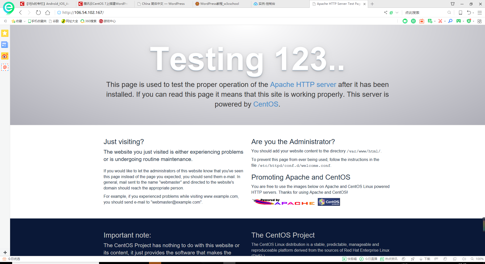
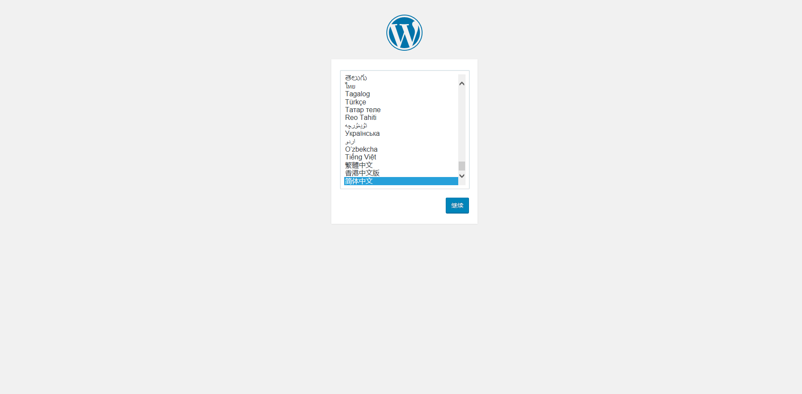
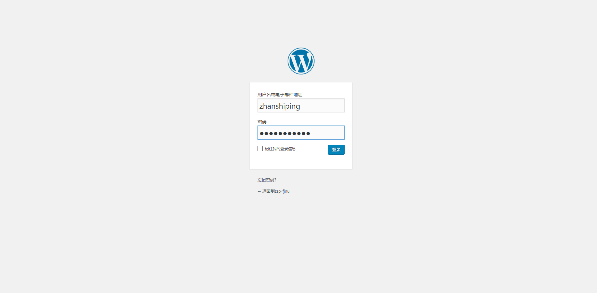

# 一、**安装Apache Web服务器**

## 1、使用yum工具安装：sudo yum install httpd

​                                                  

   

## 2、安装完成之后，启动Apache Web服务器：sudo systemctl start httpd.service

   

### 3、测试Apache服务器是否成功运行，找到腾讯云实例的公有IP地址(your_cvm_ip)，在你本地主机的浏览器上输入：http://your_cvm_ip/  若运行正常，将出现如下界面：

   

# 二、安装MySQL

## CentOS 7.2的yum源中并末包含MySQL，需要其他方式手动安装。因此，我们采用MySQL数据库的开源分支MariaDB作为替代。

## 1、 安装MariaDB：sudo yum install mariadb-server mariadb

   

## 2、安装好之后，启动mariadb：sudo systemctl start mariadb

## 3、随后，运行简单的安全脚本以移除潜在的安全风险，启动交互脚本：

## sudo mysql_secure_installation

## 设置相应的root访问密码以及相关的设置(都选择Y)。

   

 

## 4、最后设置开机启动MariaDB：sudo systemctl enable mariadb.service

   

# 三、安装PHP

## 1、PHP 7.x包在许多仓库中都包含，这里我们使用Remi仓库，而Remi仓库依赖于EPEL仓库，因此首先启用这两个仓库

## sudo yum install epel-release yum-utils

   

## sudo yum install http://rpms.remirepo.net/enterprise/remi-release-7.rpm

 

 

## 2、接着启用PHP 7.2 Remi仓库：sudo yum-config-manager --enable remi-php72

   

   

## 3、安装PHP以及php-mysql: sudo yum install php php-mysql

## 4、查看安装的php版本：php -v

   

## 5、安装之后，重启Apache服务器以支持PHP：

## sudo systemctl restart httpd.service

   

### 安装PHP模块

## 6、为了更好的运行PHP，需要启动PHP附加模块，使用如下命令可以查看可用模块：

## yum search php-

## 部分截图

   

## 7、这里先行安装php-fpm(PHP FastCGI Process Manager)和php-gd(A module for PHP applications for using the gd graphics library)，WordPress使用php-gd进行图片的缩放。

## sudo yum install php-fpm php-gd

## 8、重启Apache服务：sudo service httpd restart

   

# 四、测试PHP

## 1、这里我们利用一个简单的信息显示页面（info.php）测试PHP。创建info.php并将其置于Web服务的根目录（/var/www/html/）：sudo vim/var/www/html/info.php

   

## 2、该命令使用vim在/var/www/html/处创建一个空白文件info.php，我们添加如下内容：

## <?php phpinfo(); ?>

   

完成之后，使用刚才获取的cvm的IP地址，在你的本地主机的浏览器中输入: http://your_cvm_ip/info.php

 

   

# 五、安装WordPress以及完成相关配置

## 1、为WordPress创建一个MySQL数据库

### 1.1、首先以root用户登录MySQL数据库：mysql -u root -p

   

### 注意：MySQL的语句都以分号结尾。

### 1.2、首先为WordPress创建一个新的数据库：CREATE DATABASE wordpress;

### 1.3、接着为WordPress创建一个独立的MySQL用户：

### CREATE USER wordpressuser@localhost IDENTIFIED BY 'password';

### （CREATE USER wordpressuser@localhost IDENTIFIED BY '123456';

### ）

   

 

### 1.4、“wordpressuser”和“password”使用你自定义的用户名和密码。授权给wordpressuser用户访问数据库的权限：

### GRANT ALL PRIVILEGES ON wordpress.* TO wordpressuser@localhost IDENTIFIED BY 'password';

### （GRANT ALL PRIVILEGES ON wordpress.* TO wordpressuser@localhost IDENTIFIED BY '123456';）

   

### 1.5、随后刷新MySQL的权限：FLUSH PRIVILEGES;

   

### 1.6、最后，退出MySQL的命令行模式：exit

   

## 2、安装WordPress

### 2.1、下载WordPress至当前用户的主目录：

### cd ~

### wget http://wordpress.org/latest.tar.gz

### 2.2、wget命令从WordPress官方网站下载最新的WordPress集成压缩包，解压该文件：

### tar xzvf latest.tar.gz

### （部分截图）

   

### 2.3、解压之后在主目录下产生一个wordpress文件夹。我们将该文件夹下的内容同步到Apache服务器的根目录下，使得wordpress的内容能够被访问。这里使用rsync命令：

### sudo rsync -avP ~/wordpress/ /var/www/html/

### （部分截图）

### 2.4接着在Apache服务器目录下为wordpress创建一个文件夹来保存上传的文件：

### mkdir /var/www/html/wp-content/uploads

   

### 2.5、对Apache服务器的目录以及wordpress相关文件夹设置访问权限：

### sudo chown -R apache:apache /var/www/html/*

   

### 这样Apache Web服务器能够创建、更改WordPress相关文件，同时我们也能够上传文件。

## 3、配置WordPress

### 3.1、大多数的WordPress配置可以通过其Web页面完成，但首先通过命令行连接WordPress和MySQL。

###  定位到wordpress所在文件夹：cd /var/www/html

   

### 3.2、WordPress的配置依赖于wp-config.php文件，当前该文件夹下并没有该文件，我们通过拷贝wp-config-sample.php文件来生成：cp wp-config-sample.php wp-config.php

   

### 3.3、然后，通过nano超简单文本编辑器来修改配置，主要是MySQL相关配置：

### nano wp-config.php

   

## 4、通过Web界面进一步配置WordPress

### 4.1、经过上述的安装和配置，WordPress运行的相关组件已经就绪，接下来通过WordPress提供的Web页面进一步配置。输入你的IP地址或者域名：

### http://server_domain_name_or_IP

   

   

### 4.2、设置网站的标题，用户名和密码以及电子邮件等，点击**Install WordPress**，弹出确认页面：

### 4.3、点击**Log In**，弹出登录界面：

### 4.4、输入用户名和密码之后，进入WordPress的控制面板：

