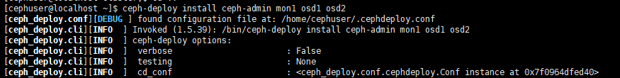

# 一、配置各个节点

## **1、安装一台最小的centos虚拟机**


## 2、**添加用户并赋予sudo权限**

```
useradd -d /home/cephuser -m cephuser

passwd cephuser

echo "cephuser ALL = (root) NOPASSWD:ALL" | sudo tee /etc/sudoers.d/cephuser

chmod 0440 /etc/sudoers.d/cephuser

sed -i s'/Defaults requiretty/#Defaults requiretty'/g /etc/sudoers
```


## 3、**安装设置open-vm-tools服务和自启动**

```
yum install -y open-vm-tools

systemctl enable vmtoolsd

systemctl start vmtoolsd
```


## **4、安装配置ntp服务**

```
yum install -y ntp ntpdate ntp-doc

ntpdate 0.us.pool.ntp.org

hwclock --systohc

systemctl enable ntpd.service

systemctl start ntpd.service
```


## **5、禁用SELINUX**

```
sed -i 's/SELINUX=enforcing/SELINUX=disabled/g' /etc/selinux/config
```


## **6、添加ceph仓库：**

```
sudo vi /etc/yum.repos.d/ceph.repo
```


## 文件内容

```
[ceph]

name=Ceph packages for $basearch

baseurl=http://mirrors.163.com/ceph/rpm-jewel/el7/$basearch

enabled=1

gpgcheck=0

priority=1

type=rpm-md

gpgkey=http://mirrors.163.com/ceph/keys/release.asc

 

[ceph-noarch]

name=Ceph noarch packages

baseurl=http://mirrors.163.com/ceph/rpm-jewel/el7/noarch

enabled=1

gpgcheck=0

priority=1

type=rpm-md

gpgkey=http://mirrors.163.com/ceph/keys/release.asc

 

[ceph-source]

name=Ceph source packages

baseurl=http://mirrors.163.com/ceph/rpm-jewel/el7/SRPMS

enabled=0

gpgcheck=0

type=rpm-md

gpgkey=http://mirrors.163.com/ceph/keys/release.asc

priority=1
```


## **7、防火墙设置**

## 开启

```
systemctl start firewalld
```


## 自启

```
systemctl enable firewalld
```


## 8、安装OpenVM工具

```
yum install -y open-vm-tools
```


## **9、克隆三台机器**

**admin**

IP：192.168.49.151

**mon1**

Ip：192.168.49.152

**osd1**

Ip：192.168.49.149

**osd2**

Ip：192.168.49.150


## **10、主控节点防火墙**设置

```
sudo firewall-cmd --zone=public --add-port=80/tcp --permanent

sudo firewall-cmd --zone=public --add-port=2003/tcp --permanent

sudo firewall-cmd --zone=public --add-port=4505-4506/tcp --permanent

sudo firewall-cmd --reload
```


## 11、**monistor节点防火墙**设置

```
sudo firewall-cmd --zone=public --add-port=6789/tcp --permanent

sudo firewall-cmd --reload
```


## **12、普通节点防火墙**设置

```
sudo firewall-cmd --zone=public --add-port=6800-7300/tcp --permanent

sudo firewall-cmd --reload  
```

### osd1


### osd2


# 二、配置SSH服务器

## **1、主控节点**

```
vi /etc/hosts
```


## 粘贴以下配置：

```
192.168.49.151        ceph-admin
192.168.49.152        mon1
192.168.49.149        osd1
192.168.49.150        osd2
```


## **设置免密登录ssh**

```
su - cephuser
```


## 生成密钥

```
ssh-keygen
```


```
vi ~/.ssh/config
```


## 文件内容如下：

Host ceph-admin 

Hostname ceph-admin 

User cephuser

Host mon1

Hostname mon1 

User cephuser

Host osd1 

Hostname osd1 

User cephuser

Host osd2 

Hostname osd2 

User cephuser

 

 

## **更改配置文件的权限**

```
chmod 644 ~/.ssh/config

ssh-keyscan osd1 osd2 mon1 >> ~/.ssh/known_hosts
```


## 使用ssh-copy-id命令将SSH密钥添加到所有节点

```
ssh-copy-id ceph-admin

ssh-copy-id mon1

ssh-copy-id osd1

ssh-copy-id osd2
```


## **测试连接各节点ssh**


# 三、ceph-deploy安装

```
sudo yum update && sudo yum install ceph-deploy
```


# **四、 创建集群**

```
mkdir cluster && cd cluster

ceph-deploy new mon1

vi ceph.conf
```


## 文件内容：


## 五、在所有节点上安装Ceph

```
ceph-deploy install ceph-admin mon1 osd1 osd2
```



## 查看版本


## 在mon1节点执行（改名）

```
hostnamectl set-hostname mon1
```


## **在主控节点**执行

```
ceph-deploy mon create-initial

ceph-deploy gatherkeys mon1
```


## **为osd创建目录**

```
sudo mkdir /var/local/osd

sudo chown ceph: /var/local/osd
```


## **在主控节点执行**

## 将管理密钥部署到所有关联的节点。

```
准备所有OSDS节点
ceph-deploy osd prepare osd1:/var/local/osd osd2:/var/local/osd

激活OSD
ceph-deploy osd activate osd1:/var/local/osd osd2:/var/local/osd

将管理密钥部署到所有关联的节点
ceph-deploy admin ceph-admin mon1 osd1 osd2
```

准备所有OSDS节点


激活OSD


将管理密钥部署到所有关联的节点


## 在所有节点上运行以下命令来更改密钥文件的权限

```
sudo chmod 644 /etc/ceph/ceph.client.admin.keyring
```


# 六、检查集群状态

## **从ceph-admin节点登录到ceph监视服务器“ mon1 ”， 运行以下命令以检查集群运行状况。**

```
ssh mon1

sudo ceph health
```


## **检查集群状态**

```
sudo ceph -s
```

